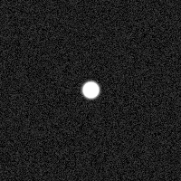

Welcome to the Artificial Images Simulator's documentation!
===========================================================

This repo contains the software of the Artificial Images Simulator (AIS). 
The AIS was developed using python 3 language to create cubes of artificial 
star images, simulating those images that would be acquired by using the 
SPARC4 [#SPARC4]_ CCD cameras in astronomical observations. To create the 
images, the AIS models the star flux distribution as a 2D-Gaussian 
Distribution. This result is added to a noise image, created based on the 
noise information of the SPARC4 CCDs, as a function of their operation mode. 
Figure below presents an example of an image created by the AIS. This page 
explains the step-by-step procedure of the AIS to create the images. 
Also, it is presented a simple execution example. 

References
----------

.. [#SPARC4] Claudia V. Rodrigues, Keith Taylor, Francisco J. Jablonski, Marcelo Assafin, Alex Carciofi, Deonisio Cieslinski, Joaquim E. R. Costa, Ruben Dominguez, Tania P. Dominici, Gabriel A. P. Franco, Damien J. Jones, Antonio Kanaan, René Laporte, Antonio M. Magalhaes, André Milone, José A. Neri, Antonio Pereyra, Luiz A. Reitano, Karleyne M. G. Silva, Cesar Strauss, "Concept of SPARC4: a simultaneous polarimeter and rapid camera in 4 bands," Proc. SPIE 8446, Ground-based and Airborne Instrumentation for Astronomy IV, 844626 (24 September 2012); https://doi.org/10.1117/12.924976 
.. _LICENSE: license

.. toctree::    
    :hidden:       
    
    software_description      
    Code <code/modules>
    license
    contact

   
   
